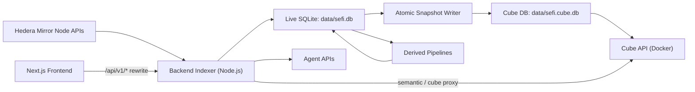

# SeFi

SeFi is a Hedera data platform that indexes protocol activity into SQLite, builds a semantic analytics layer with Cube, and exposes everything through a backend API + Next.js dashboard + agent interfaces.

SeFi is protocol-agnostic: Bonzo is one supported manifest set, not a hardcoded dependency.

## What SeFi Does

SeFi solves a common analytics problem for DeFi/on-chain apps:

- Mirror node data is large, low-level, and expensive to repeatedly query
- dashboards need fast, stable, filterable data
- AI/agent workflows need semantic, validated, and policy-aware query paths

SeFi provides:

- host-native ingestion into `data/sefi.db` (live writer)
- atomic Cube snapshot database `data/sefi.cube.db` (reader-friendly)
- derived pipelines for higher-level protocol tables
- Cube semantic models for BI and query abstraction
- APIs for operations, modeling, analytics, and agents
- frontend workspace for indexing, modeling, and agents/converse UX

## High-Level Architecture



## Core Components

### 1) Backend (`backend/`)

Responsibilities:

- manifest loading and validation
- mirror-node ingestion (`sync`, targeted syncs, `listen`)
- schema management + migrations
- derived pipeline orchestration
- Cube proxy and health/readiness logic
- auth/session handling (open, token, demo/full-access)
- frontend/agent APIs (stateful sessions + stateless completions)
- SSE streams (`status/stream`, realtime, chat stream)

### 2) Live and Snapshot Databases (`data/`)

- `sefi.db`: live writable store used by backend/indexer
- `sefi.cube.db`: reader snapshot used by Cube

Why split DBs:

- keeps ingestion and analytics read workloads isolated
- avoids lock contention between indexer writes and Cube queries
- allows atomic snapshot replacement for safer analytics access

### 3) Cube Semantic Layer (`cube/`)

- curated cube models over protocol and derived tables
- semantic query capability used by modeling pages + agents
- enables measure/dimension abstraction over raw SQL

### 4) Frontend (`frontend/`)

- Next.js app with dashboard workspace and agent workspace
- rewrites `/api/v1/:path*` to backend (`127.0.0.1:3210` default)
- status and auth gating UX for demo/full access
- converse chat experience wired to backend chat session APIs

## Data Flow in Detail

### A) Ingestion Flow

1. Load manifests from `contracts/manifests/*.json`
2. Resolve network scope (`SEFI_NETWORK`, `SEFI_NETWORKS`)
3. Pull mirror node data (contracts, logs, token transfers, topic messages)
4. Upsert normalized records into `sefi.db`
5. Track sync cursors and activity events
6. Trigger derived updates (realtime or scheduled/reconcile)

### B) Derived Pipeline Flow

1. Source definitions read raw/near-raw data
2. Pipelines materialize higher-level protocol tables
3. Status exposes lag/backlog and run history
4. Results stay in `sefi.db` for downstream Cube + API usage

### C) Snapshot and Cube Flow

1. Backend writes an atomic snapshot to `sefi.cube.db`
2. Cube reads snapshot DB only (not live DB)
3. Backend proxy endpoints (`/api/v1/cube/*`) route semantic requests
4. Health probes use Cube `/readyz` with timeout and failure-state logic

### D) Frontend/Agent Flow

1. Frontend calls `/api/v1/*` via rewrite proxy
2. Backend handles auth state/session and request policy
3. Agent APIs use semantic context + planner + execution policy
4. Chat sessions persist user/assistant messages and events
5. UI polls/streams status and chat updates

## Auth and Access Model

SeFi supports multiple modes:

- open mode: no auth required
- token mode: `SEFI_API_TOKEN` required for protected routes
- demo mode: read + selected write capabilities, full access via access key/session

Key auth endpoints:

- `GET /api/v1/auth/state`
- `POST /api/v1/auth/session`
- `POST /api/v1/auth/logout`

Demo mode policy includes a write allowlist for safe UI functions (e.g. query/chat flows), while restricting dangerous operations until full access is granted.

## API Surface (Grouped)

### Service + Status

- `/api/v1/health`
- `/api/v1/status`
- `/api/v1/status/stream`
- `/api/v1/realtime/stream`

### Indexing

- `/api/v1/index/sync`
- `/api/v1/index/sync/contracts`
- `/api/v1/index/sync/hts`
- `/api/v1/index/sync/topics`
- `/api/v1/index/listen`
- `/api/v1/index/stop`
- `/api/v1/index/reset`

### Cube and Querying

- `/api/v1/cube/health`
- `/api/v1/cube/meta`
- `/api/v1/cube/query`
- `/api/v1/modeling/sqlite/query`

### Modeling and API Builder

- `/api/v1/modeling/*`
- `/api/v1/apis*`
- `/api/v1/endpoints/:slug`

### Derived System

- `/api/v1/derived/*`

### Agent Platform

- `/api/v1/agents/frontend/bootstrap`
- `/api/v1/agents/chat/sessions*`
- `/api/v1/agents/chat/completions`
- `/api/v1/agents/playground/*`
- `/api/v1/agents/*` (managed agents)

## Repository Layout (Now Rooted)

This repository is now rooted directly at SeFi (not nested under a `SeFi/` folder).

- `backend/` backend indexer + API
- `frontend/` Next.js dashboard
- `contracts/manifests/` protocol manifest inputs
- `cube/` Cube models and config
- `data/` live + snapshot SQLite files
- `scripts/` stack orchestration and utilities
- `docker-compose.yml` Cube/optional service topology

## Quick Start

### Prerequisites

- Node.js 18+
- npm
- Docker Desktop (for Cube)

### 1) Configure environment

Create or update `.env` in repo root (example values):

```bash
SEFI_NETWORK=mainnet
SEFI_NETWORKS=mainnet
SEFI_CUBE_API_TOKEN=sefi-local-dev
SEFI_DEMO_MODE=true
SEFI_DEMO_ACCESS_KEY=hedera
OPENAI_API_KEY=...
```

### 2) Start host backend + Docker Cube

```bash
npm start
```

Detached mode:

```bash
npm run start:detached
```

### 3) Run frontend

```bash
npm run frontend:dev
```

- Frontend: `http://localhost:3000`
- Backend API: `http://localhost:3210/api/v1`

## Operational Commands

```bash
npm run test:stack
npm run logs
npm run stop
npm run backend:dev
npm run frontend:dev
npm run start:containerized
```

Bonzo manifest import:

```bash
npm run manifest:import:bonzo
```

## Environment Variables (Most Important)

### Core Runtime

- `SEFI_PORT` backend port (default `3210`)
- `SEFI_NETWORK` primary network
- `SEFI_NETWORKS` indexed networks CSV
- `SEFI_DB_PATH` live DB path
- `SEFI_CUBE_DB_PATH` snapshot DB path

### Mirror/Cube

- `SEFI_MIRROR_NODE_URL`
- `SEFI_REQUEST_TIMEOUT_MS`
- `SEFI_CUBE_API_URL`
- `SEFI_CUBE_API_TOKEN`
- `SEFI_CUBE_HEALTH_TIMEOUT_MS`

### Auth and Sessions

- `SEFI_API_TOKEN`
- `SEFI_REQUIRE_AUTH`
- `SEFI_DEMO_MODE`
- `SEFI_DEMO_ACCESS_KEY`
- `SEFI_ALLOWED_ORIGINS`

### Agent/AI

- `OPENAI_API_KEY`
- `OPENAI_MODEL_FAST`
- `OPENAI_MODEL_STRONG`
- `SEFI_AGENT_AUTO_EXECUTE_DEFAULT`
- `SEFI_AGENT_SQL_FALLBACK_DEFAULT`

## Reliability Notes

- DB read probes continuously update backend health state
- Cube health probing classifies degraded/down with thresholding
- status endpoints prefer cached metrics in hot paths to reduce lock pressure
- derived status is periodically cached to avoid expensive per-request recomputation
- snapshot writes are atomic to reduce corruption risk under concurrent reads

## Troubleshooting

### Frontend shows proxy errors (`ECONNREFUSED` / `ECONNRESET`)

- verify backend is up on `127.0.0.1:3210`
- verify frontend rewrite target is correct
- for long-running requests, ensure proxy timeout is high enough (configured in `frontend/next.config.mjs`)

### Auth popup not showing in demo/full-access mode

- verify `GET /api/v1/auth/state` succeeds
- verify `.env` has expected demo/auth vars
- ensure backend was started from repo root or with env loaded

### Cube appears down or stale

- check `GET /api/v1/cube/health`
- inspect Docker container status and `cube/` configuration
- verify snapshot DB path and file permissions

## Additional Docs

- [Backend Guide](backend/README.md)
- [Frontend Guide](frontend/README.md)
